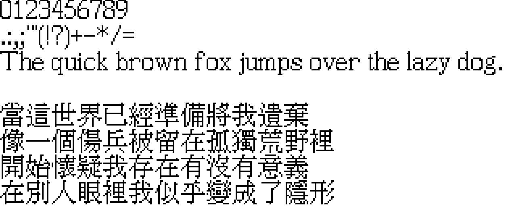

[中文](README.MD)|[EN](./README-EN.MD)

# EryaMincho

 

## Description
**EryaMincho** is a 15×15 Bitmap Mincho style font，which is mainly designed and drawn by Koolhaas. It's still in the development stage.

## Concept
Striving to create a bitmap font for **inherited glyphs** that can **free to use**, **makes sense** according to character logic, and **looks the best**!

## Coverage
Planning to support the CJK Unified Ideographs Basic Block and Extension A.

## License
This project uses the SIL Open Font License 1.1.

Before August 8, 2026, this project used CC BY-ND 4.0 (that is, the versions before the `old-license` tag). To make it easier for others to contribute and modify this font, the license was changed on August 8, 2026.

The old versions are bound by the original license.

## Sponsor
