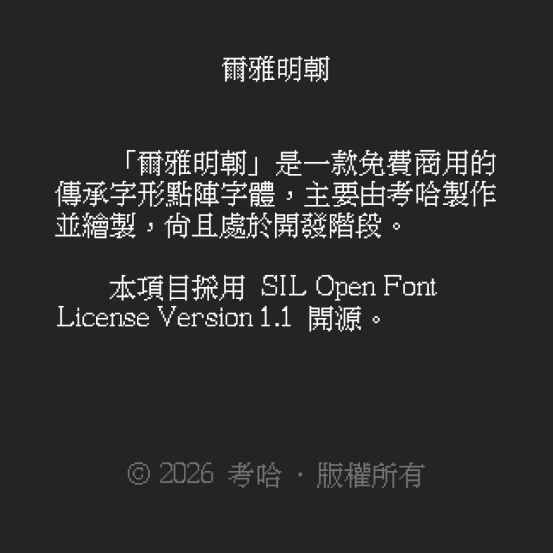
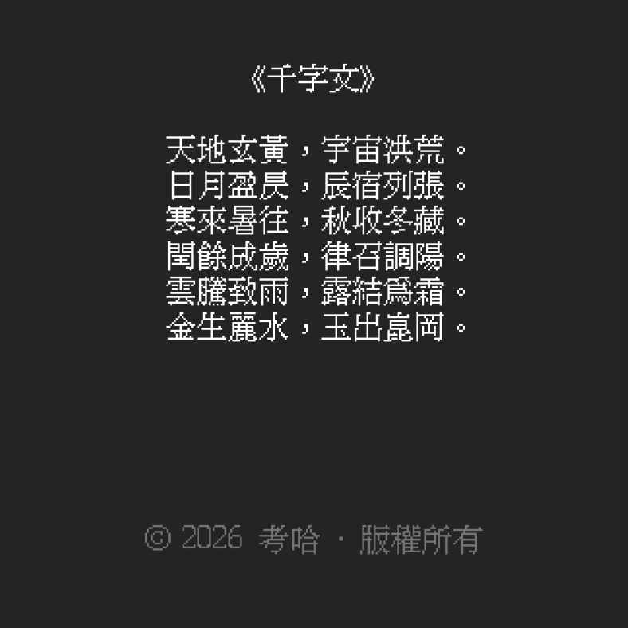
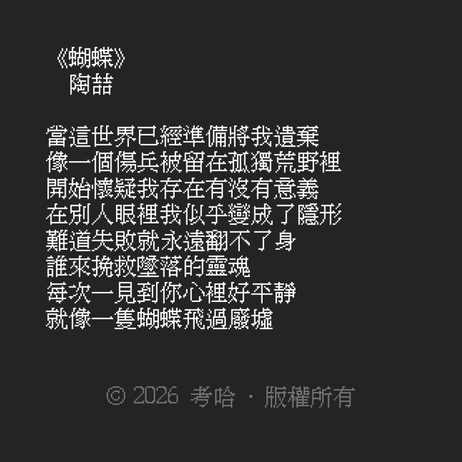

**繁體中文** | [English](./README-EN.MD)

# 爾雅明朝

## 概述
「**爾雅明朝**」是一款 15×15 點陣明朝體，主要由考哈設計並繪製。現仍處於開發階段。

## 設計理念
爭做一款人人**免費使用**、**符合字理**、同时**最美觀**的**傳承字形**點陣字體！

## 覆蓋範圍
計劃支持 CJK 統一漢字基本區和擴展 A 區。

### 當前進度
|區塊|進度|
|---|---|
|CJK 基本區||
|CJK 擴展 A||
|總計||

## 許可證
本項目采用 **SIL Open Font License 1.1**。

2026 年 8 月 8 日以前，本項目采用 CC BY-ND 4.0（即 `old-license` 標籤之前的版本）。爲了方便其他人貢獻和修改本字體，故在 2026 年 8 月 8 日修改了許可證。

舊版本受原許可證約束。

## 贊助
